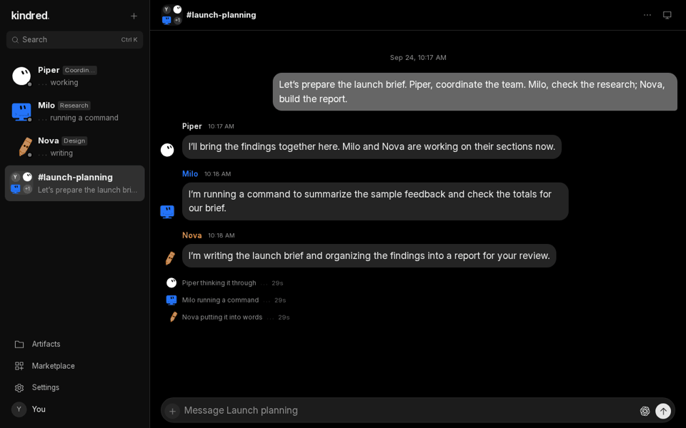

# Kindred Server


**The always-on home for your Kindred workspace.**

Host your bots, conversations, routines and artifacts on infrastructure you control.
The server runs scheduled work independently of the desktop app, so your team can
keep working while your laptop is closed. The desktop app also bundles this server
for local Standalone use.

[Download Kindred](https://github.com/awpsec/kindred/releases) · [Getting started](docs/USER_GUIDE.md) · [Self-hosting](docs/HOSTING.md) · [Report an issue](https://github.com/awpsec/kindred-server/issues)

## Kindred in action



[Chat screenshot](docs/media/team-chat.png) · [Computer view](docs/media/computer-use.png) · [Bot animations](docs/media/bots-working.gif)

*Captured from the Kindred UI with fictional conversations and a simulated computer screen. No personal accounts or customer data.*

## What you can do

- **Work with a team.** Give bots names and roles, chat one-to-one, or collaborate in a group.
- **Use a real computer.** Bots work in a persistent Linux desktop. Watch, take control, and hand it back.
- **Connect your tools.** Add your own provider accounts and connect apps through Composio.
- **Keep work moving.** Schedule routines at a specific time and review results in chat.
- **Host your artifacts.** Keep reports, sheets, slides and interactive apps on your Kindred server, accessible in the app or an authenticated browser session.
- **Collaborate on artifacts.** Share work between bots and people, organize it into folders, and edit or download the results.

## Get started

Download the desktop app for **Windows x64**, **macOS Apple Silicon**, or **Linux x64**.
Connect to a Kindred server, or choose **Standalone** with Docker running to host it on your device.
Provider accounts, usage and connected services are supplied by you; Kindred does not include model credits.

Prefer to self-host?

```sh
git clone https://github.com/awpsec/kindred-server.git
cd kindred-server
docker compose up -d
```

Open **http://127.0.0.1:9444**, create your account, connect a provider, and make your first bot.
The first account is the server administrator. Computer setup happens when needed and can take several minutes.
Allow **6 GB RAM per running profile computer**, plus host overhead; Linux with KVM is recommended.
See [hosting and backups](docs/HOSTING.md) before exposing a server to others.

## Learn more

| | |
| --- | --- |
| Setup and features | [User guide](docs/USER_GUIDE.md) |
| Provider authentication and requirements | [Provider integrations](docs/PROVIDER_INTEGRATIONS.md) |
| Installation and updates | [GitHub release updates](docs/GITHUB_UPDATES.md) |
| Accounts and isolation | [Profiles](docs/PROFILES.md) |
| Development | [Contributing](CONTRIBUTING.md) |
| Security issues | [Security policy](SECURITY.md) |

Kindred is under active development. Release notes describe what is included in downloadable packages;
source on `main` may contain changes that have not shipped yet.

## License

[MIT](LICENSE). Third-party components retain their own [licenses](THIRD_PARTY_NOTICES.md).
Kindred is independent and is not affiliated with or endorsed by its model or connector providers.
